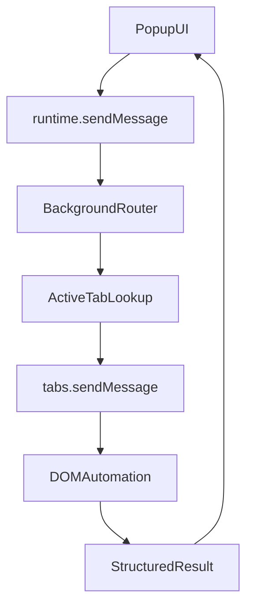

# Background And Events Guide

Official references:

- [MDN Background scripts](https://developer.mozilla.org/en-US/docs/Mozilla/Add-ons/WebExtensions/Background_scripts)
- [MDN background manifest key](https://developer.mozilla.org/en-US/docs/Mozilla/Add-ons/WebExtensions/manifest.json/background)

## Firefox MV3 Note

For Firefox Manifest V3, this project uses:

```json
{
  "background": {
    "scripts": ["background.js"]
  }
}
```

This is deliberate. Firefox supports MV3 but still uses `background.scripts` as the reliable Firefox path, while Chrome relies on `background.service_worker`.

## Pattern Used In This Scaffold

- Register listeners at module top level.
- Initialize durable state in `runtime.onInstalled`.
- Load settings from `browser.storage.local` instead of relying on globals.
- Route messages in one background entry point.
- Return structured success/error objects instead of ad hoc values.

## Event Handling Guidance

- Register listeners synchronously.
- Persist data that must survive background page unloads.
- Avoid assuming the current tab stays unchanged during async work.
- Reject unsupported tab URLs before invoking page automation.

## Extension Flow



## Future Enhancements

- Add alarm-driven jobs with `browser.alarms`
- Add context menu triggers with `browser.menus`
- Add site-specific automation profiles stored in `storage.local`
